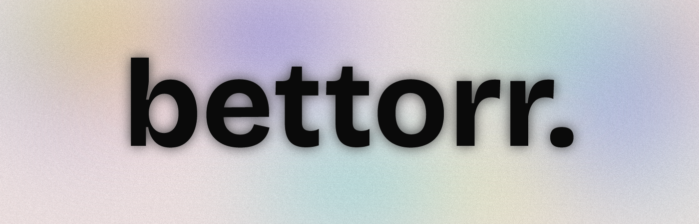

<div align="center">
  

  # 🎮 Bettorr - Game Torrent Search Engine

  [](https://bettorr.vercel.app)
  [](https://github.com/iam-sahil/bettorr)
  [](https://github.com/iam-sahil/bettorr)
</div>

---

<div align="center">
  <h3>🚀 Your go-to modern, minimalistic web interface for searching game torrents from multiple trusted sources.</h3>
  <p>Experience a complete design overhaul for 2024, featuring a stunning dark theme with sophisticated glass morphism effects, subtle grain textures, and a smooth blur.</p>
</div>

---

## ✨ Key Features

Bettorr is packed with features designed to make your game torrent search efficient and enjoyable:

<table>
  <tr>
    <td align="center">
      <b>🔍 Smart Search</b><br>
      Real-time search with intelligent autocomplete for quick results.
    </td>
    <td align="center">
      <b>🎯 Source Filtering</b><br>
      Easily filter results from 8+ trusted sources, finding exactly what you need.
    </td>
  </tr>
  <tr>
    <td align="center">
      <b>⚡ Lightning Fast</b><br>
      Optimized search and smooth loading states for a seamless experience.
    </td>
    <td align="center">
      <b>🎨 Modern UI/UX</b><br>
      Enjoy a complete design overhaul with glass morphism, a sleek dark theme, and compact spacing.
    </td>
  </tr>
  <tr>
    <td align="center">
      <b>📱 Fully Responsive</b><br>
      A perfect experience whether you're on desktop or mobile.
    </td>
    <td align="center">
      <b>🔗 Direct Downloads</b><br>
      One-click access to magnet links for instant downloads.
    </td>
  </tr>
  <tr>
    <td align="center">
      <b>🌈 Theming Options</b><br>
      Switch between multiple accent color themes with an easy toggle and PWA support.
    </td>
    <td align="center">
      <b>⌨️ Intuitive Keyboard Shortcuts</b><br>
      Boost your workflow with shortcuts like Ctrl+K to focus search and Enter to search.
    </td>
  </tr>
  <tr>
    <td align="center">
      <b>♿ Enhanced Accessibility</b><br>
      Designed with keyboard navigation, proper focus management, and screen reader friendliness.
    </td>
    <td align="center">
      <b>🆕 Constantly Expanding Sources</b><br>
      Now includes RuTracker, Shisuy, TinyRepacks, and more!
    </td>
  </tr>
</table>

---

## 🎯 Our Trusted Sources

Bettorr aggregates results from a curated list of reliable game torrent sources:

<table>
  <tr>
    <td align="center">
      <b>🎮 DODI Repacks</b><br>
      High-quality game repacks with excellent compression.
    </td>
    <td align="center">
      <b>💎 FitGirl Repacks</b><br>
      Well-known for compressed game releases with integrity checks.
    </td>
  </tr>
  <tr>
    <td align="center">
      <b>⚡ KaosKrew</b><br>
      Game releases and updates from a trusted community.
    </td>
    <td align="center">
      <b>🌐 OnlineFix</b><br>
      Specializing in online multiplayer fixes and patches.
    </td>
  </tr>
  <tr>
    <td align="center">
      <b>🎯 Xatab</b><br>
      Game repacks and releases, often with Russian localization.
    </td>
    <td align="center">
      <b>🧲 RuTracker</b><br>
      A massive Russian tracker with an extensive game library.
    </td>
  </tr>
  <tr>
    <td align="center">
      <b>🦊 Shisuy</b><br>
      Curated repacks and game releases.
    </td>
    <td align="center">
      <b>🧩 TinyRepacks</b><br>
      Ideal for small-size repacks, perfect for bandwidth-conscious users.
    </td>
  </tr>
</table>

---

## 🚀 Get Started in Seconds!

<div align="center">
  <h3>Bettorr is designed for simplicity and speed.</h3>
</div>

### 1. 🔍 Search for Games
- Simply type in the search bar to find your favorite games.
- Benefit from **intelligent autocomplete** suggestions as you type, and get **instant results** from multiple sources.
- Use **keyboard shortcuts** (Ctrl+K, /, Enter, etc.) for even faster navigation.

### 2. 🎯 Filter by Source
- Utilize the **filter buttons** to narrow down your search to specific sources.
- Prefer a broader search? View all sources for **comprehensive results**. Find exactly what you're looking for, faster.

### 3. ⬇️ Download Instantly
- Click the "Download Magnet" button for your chosen game.
- Get **direct magnet links** for immediate downloading. No redirects, no waiting – just pure speed!

### 4. 🎨 Switch Themes
- Use the **theme toggle button** to cycle through beautiful accent colors.
- Enjoy a consistent, modern look that matches your preference.

---

## 🛠️ Technology Behind Bettorr

Bettorr is built with modern web technologies to deliver a fast, beautiful, and accessible experience:

<table>
  <tr>
    <td align="center">
      <b>🌐 Frontend Core</b><br>
      HTML5, CSS3, JavaScript (ES6+)
    </td>
    <td align="center">
      <b>🎨 Design Principles</b><br>
      Glass Morphism, Dark Theme, Smooth Animations, Comprehensive Theming
    </td>
  </tr>
  <tr>
    <td align="center">
      <b>📱 Responsive Strategy</b><br>
      Built with a mobile-first design approach ensuring adaptability.
    </td>
    <td align="center">
      <b>⚡ Performance Focus</b><br>
      Optimized loading and highly efficient search algorithms.
    </td>
  </tr>
  <tr>
    <td align="center" colspan="2">
      <b>🔧 Essential Tools</b><br>
      Leveraging Lucide Icons and Google Fonts (Inter) for a polished look.
    </td>
  </tr>
</table>

---

## 📁 Project Structure

```
bettorr/
├── 📄 index.html            # Main HTML file with SEO optimization
├── 🎨 styles.css            # CSS styles with beautiful glass morphism effects
├── ⚡ script.js             # Core JavaScript functionality and search logic
├── 📖 README.md             # This comprehensive documentation you're reading!
├── 🗺️ sitemap.xml           # SEO sitemap for improved search engine indexing
├── 🤖 robots.txt            # Instructions for web crawlers
└── 📁 magnet_data/          # JSON data files from all trusted sources
    ├── dodi.json
    ├── fitgirl.json
    ├── kaoskrew.json
    ├── onlinefix.json
    ├── xatab.json
    ├── rutracker.json
    ├── shisuy.json
    └── tinyrepacks.json
```

---

## 📊 Data Format

Each JSON file within `magnet_data/` follows a consistent, structured format for optimal performance and easy parsing:

```json
{
  "name": "source_name",
  "downloads": [
    {
      "title": "Game Title",
      "fileSize": "10.5 GB",
      "uris": ["magnet:?xt=..."],
      "uploadDate": "2024-01-01T00:00:00.000Z"
    }
  ]
}
```

-----

## 🌐 Browser Compatibility

Bettorr is designed to work flawlessly across modern web browsers:

<table>
<tr>
<td align="center">
<b>✅ Chrome</b><br>
Recommended for the best experience.
</td>
<td align="center">
<b>✅ Firefox</b><br>
Full Support
</td>
<td align="center">
<b>✅ Safari</b><br>
Full Support
</td>
<td align="center">
<b>✅ Edge</b><br>
Full Support
</td>
</tr>
</table>

-----

## 🤝 Contributing to Bettorr

<div align="center">
<h3>We warmly welcome contributions from the community!</h3>
</div>

Your ideas and efforts can help make Bettorr even better.

### How to Contribute:

1.  **🔧 Fork the Repository:** Start by forking the Bettorr repository on GitHub and cloning it to your local machine.
2.  **💡 Make Your Changes:**
      * Add exciting new features or improvements.
      * Help us by fixing bugs or enhancing performance.
      * Improve existing documentation for clarity.
3.  **📝 Submit a Pull Request:**
      * Provide a clear and detailed description of your changes.
      * Ensure all tests pass.
      * Adhere to the existing code style.

### Areas Where You Can Contribute:

  - ✨ Implementing new features and enhancements.
  - 🎨 Improving UI/UX design.
  - ⚡ Optimizing performance.
  - 📚 Updating and expanding documentation.
  - 🐛 Fixing bugs and addressing issues.
  - 🔍 Integrating new data sources.

-----

## 📄 License

<div align="center">
<p>Anyone may use this project in any sort of manner as along as there is no monetory benefit acheived from the work</p>

<p><b>Disclaimer:</b> This application is for educational purposes only. Please ensure you comply with all local laws and regulations regarding torrent downloads in your region.</p>
</div>

-----

<div align="center">
<h3>🌟 If you find Bettorr helpful, please consider starring this repository!</h3>

<p>
<a href="https://bettorr.vercel.app">🌐 Visit Website</a> •
<a href="https://github.com/iam-sahil/bettorr">📁 View on GitHub</a> •
<a href="https://github.com/iam-sahil/bettorr/issues">🐛 Report Issues</a>
</p>

<p><b>Made with ❤️ by https://github.com/iam-sahil</b></p>
</div>
